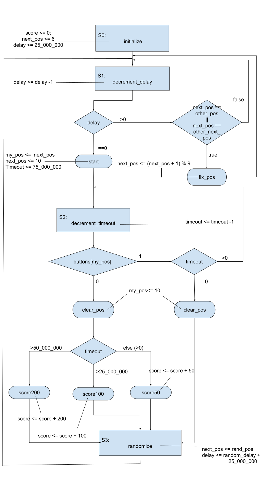

# Whack-A-Mole

This project is inspired by the game “Whack-A-Mole”, an arcade game in which players use a mallet to hit toy moles, which appear at random, back into their holes. This version is a 2-player version of that game. There are 9 buttons and each button has 2 differently coloured LEDs above it. The LEDs keep lighting up randomly, and the player the colour of the LED corresponds to is supposed to hit it. The faster the button is hit the more points that player scores. If a certain amount of time passes, and the button is not pressed, the LED turns off and the player gets zero points for it. Each player’s score is displayed on a 7-segment display, and the timer for the game is displayed on another 7-segment display. When the timer reaches zero, the game displays which player won based on their score and lights up all the LEDs corresponding to that player.

This project uses Quartus and an Altera DE2-115 FPGA.

## Overview

Each player chooses a color (red or green) and each one has to press a button when the LED that corresponds to the player’s color turns on. The score starts to increment once a button is pressed. It is incremented by 200 if the button was pressed within the first half second of the LED lighting up, and incremented by 100 in the second half second and by 50 within the third half second. After a second and a half if the player didn't press a button, the LED turns off , another one turns on and the player gets zero points.  The whole game is 60 seconds. 

The game starts once the main module whack_a_mole is loaded on the Altera-Board. Details of how the module runs are listed in the implementation section.  


## Design Methodology
### RTL Design

> TODO

### Devices
We used a big breadboard to put the components used on it, and the components are:
- (18) LEDs : (9) Red and (9) Green for the players.
- (2) 4 to 16 Line Decoder to light the LEDs randomly on the board according to the selection inputs from the code.
- (2) Seven segments displays other than ones on the board to display the duration of the game.
- (2) Seven segments decoders to directly convert the inputs coming from the code to the seven segment display.
- (9) Push buttons which give feed back from the breadboard to the Altera board when pressed.
- A number of jumpers and wires were used for the connections.

## Implementation
### Module Description

- `module whack_a_mole (clk, buttons, p1_leds_out, p2_leds_out, p1_score_segss, p2_score_segss, countdown, test_p1_leds, test_p2_leds, p1_s0_led, p1_s1_led, p1_s2_led, p1_s3_led, p2_s0_led, p2_s1_led, p2_s2_led, p2_s3_led, voltage);`
 This is the main module. It takes as in input the clock and the input signals for the buttons pressed. The main module uses the following modules.

- `module clk_generator(clk,clk_1hz);`
	Takes in the 50 hz and outputs a 1 hz clock.

- `module countdown_99_sec (clk_1hz,sec);`
Uses the 1 hz clock from the clk_generator and outputs the timer in sec as two decimal digits concatenated together. 

- `module delay_generator (clk,delay);`
Takes as an input the clk and pseudo-randomizes the delay between the current lit led and led that has to be lit next.

- `module position_generator(clk,position);` Takes as input the clk and pseudo-randomizes the position of the next led that has to be lit.

- `module player1_module (clk,buttons, other_player_pos, other_player_next_pos, rand_pos, random_delay, my_pos, next_pos, score, s0_led,s1_led,s2_led,s3_led);` 	
	Calls the module player_controller and player1_datapath.

- `module player_controller (clk, buttons, other_player_pos, other_player_next_pos, my_pos, next_pos, delay_countdown, timeout_countdown,	initialize, decrement_delay, fix_pos, start, decrement_timeout, clear_pos, score200, score100, score50, randomize, s0_led, s1_led, s2_led, s3_led);` 			
Illustrated in the ASM chart

- `module player1_datapath (initialize, decrement_delay, fix_pos, start, decrement_timeout, clear_pos, score200, score100, score50, randomize, rand_pos, random_delay, clk, score, next_pos, delay_countdown, my_pos, timeout_countdown);`
Illustrated in the ASM chart

- `module player2_module (clk, buttons, other_player_pos, other_player_next_pos, rand_pos, random_delay, my_pos, next_pos, score, s0_led,s1_led,s2_led,s3_led);`
The same as player1_module but for player 2.

- `module four_digit_bcd (number,digit_4,digit_3,digit_2,digit_1);`
Takes in the whole score from the player1_module and player2_module and outputs it as 4 separate digits.  

- `module seven_seg_dec(num, segments);`
	Takes in each digit of the player’s score and outputs the segments that displays it on the 7-segment of the Altera Board.

- ```
  module game_end ( clk, clk_1hz, countdown, p1_score, p2_score, //inputs
	p1_leds_in, p2_leds_in,  //inputs
	p1_digit1_in, p1_digit2_in, p1_digit3_in, p1_digit4_in, //inputs
	p2_digit1_in, p2_digit2_in, p2_digit3_in, p2_digit4_in, //inputs
	p1_leds_out, p2_leds_out, //output
	p1_digit1_out, p1_digit2_out, p1_digit3_out, p1_digit4_out,//output
	p2_digit1_out, p2_digit2_out, p2_digit3_out, p2_digit4_out );//output
  ``` 
  Handles the end of the game by comparing the scores of the two players. 
When the countdown reaches zero it lights the leds of the winning team
one by one. If there is a draw, it lights the leds of both teams.

- `module decoder (in, out);`
For testing using the leds of the FPGA. 
	
### Circuit diagram
> TODO

### ASM Chart


